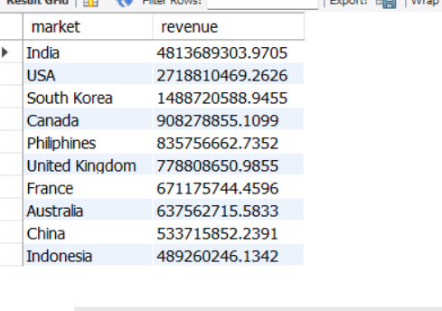
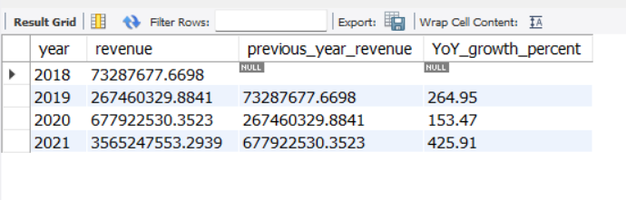
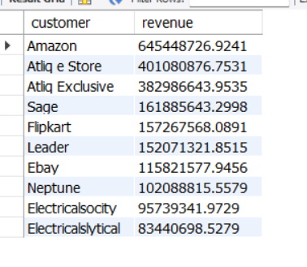
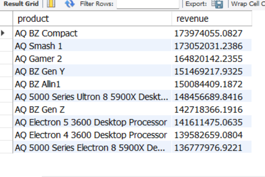

# Atliq Hardware – Market & Product Performance Analysis (SQL Project)

SQL project analyzing global sales performance, product profitability, and market expansion opportunities for **Atliq Hardware**.

---

# Project Summary

This project analyzes the global sales performance of **Atliq Hardware**, a computer hardware manufacturer operating across multiple international markets and distribution channels.

Using **SQL (MySQL)**, the project explores more than **1.4 million sales records** to identify revenue drivers, profitable products, customer contribution patterns, and market performance trends.

The objective of this analysis is to support **data-driven business decisions** regarding market expansion, product optimization, and revenue growth.

---

# Key Metrics

| Metric              | Value               |
| ------------------- | ------------------- |
| Total Sales Records | 1,425,706           |
| Total Products      | 389                 |
| Total Customers     | 209                 |
| Data Period         | Sep 2017 – Dec 2021 |
| Total Revenue       | $3.5B+              |

---

# Business Problem

Atliq Hardware sells hundreds of products across multiple markets through different distribution channels.

However, management lacks clear insights into:

* Which markets generate the highest revenue
* Which products drive company sales
* Which products generate the most profit
* Which customers contribute the largest share of revenue
* How the company's revenue has grown over time

This project answers these questions using **SQL-based business analysis**.

---

# Dataset Overview

The dataset follows a **data warehouse structure optimized for analytics**.

## Dimension Tables

* dim_customer
* dim_product
* dim_date

## Fact Tables

* fact_sales_monthly
* fact_gross_price
* fact_manufacturing_cost
* fact_freight_cost
* fact_pre_invoice_deductions
* fact_post_invoice_deductions
* fact_forecast_monthly

---

# Business Structure

## Customers

Examples include:

* Amazon
* Atliq Exclusive
* Atliq e Store

## Sales Channels

Products are distributed through:

* Retailers
* Distributors
* Direct Channels

## Markets

The company operates in multiple global markets including:

* India
* United States
* South Korea
* Canada
* United Kingdom

---

# Analytical Approach

The project follows a structured data analysis workflow:

1. Data exploration
2. Revenue analysis
3. Product performance analysis
4. Profitability analysis
5. Customer contribution analysis
6. Revenue trend analysis
7. Customer segmentation
8. Market ranking

A total of **13 SQL queries** were written to perform this analysis.

---

# SQL Analysis Performed

## Data Exploration

* Total Sales Records
* Total Unique Products
* Total Unique Customers
* Dataset Date Range

## Revenue Analysis

* Total Company Revenue
* Top Products by Revenue

## Profitability Analysis

* Top Products by Profit

## Customer Analysis

* Top Customers by Revenue
* Revenue Contribution Percentage

## Time Series Analysis

* Revenue by Year
* Year-over-Year Revenue Growth

## Segmentation & Ranking

* Customer Segmentation
* Market Ranking by Revenue

---

# SQL Analysis Results

## Revenue by Market

This analysis identifies which markets contribute the most to overall revenue.

**Insight**

India and the USA generate the highest revenue for the company, indicating strong demand in these regions and highlighting potential opportunities for further expansion.

---

## Year-over-Year Revenue Growth

This analysis measures revenue growth across different years using SQL window functions.

**Insight**

The company demonstrates strong year-over-year revenue growth, indicating increasing demand and successful market expansion strategies.

---

## Top Customers by Revenue

This analysis identifies the customers contributing the most to total revenue.

**Insight**

Major enterprise customers such as **Amazon** and **Atliq e Store** contribute a significant portion of revenue, indicating strong partnerships with large distribution channels.

---

## Top Products by Revenue

This analysis highlights the best-performing products based on revenue.

**Insight**

Products like **AQ BZ Compact** and **AQ Smash 1** are among the top-performing products, contributing significantly to overall revenue and indicating strong product-market demand.

---

# Key Business Insights

## Market Performance

India and the United States represent the company’s strongest markets, suggesting opportunities for deeper regional expansion strategies.

## Product Performance

The **AQ BZ product series** plays a major role in driving company revenue and profitability.

## Customer Concentration

A small number of customers contribute a significant portion of total revenue, highlighting potential revenue concentration risks.

## Revenue Growth

Revenue growth trend:

* 2018 — $73M
* 2019 — $267M
* 2020 — $678M
* 2021 — $3.56B

The company experienced rapid growth, particularly after 2020, indicating strong market expansion and increasing product demand.

---

# Business Recommendations

Based on the analysis:

* Increase marketing investment in high-performing markets such as **India and the United States**
* Focus on expanding the **AQ BZ product line**
* Reduce dependency on a small group of customers by expanding the customer base
* Monitor revenue growth trends to identify emerging markets

---

# SQL Skills Demonstrated

This project demonstrates core SQL skills used by data analysts:

* Data exploration
* Multi-table joins
* Aggregations
* Subqueries
* Window functions
* CASE statements
* Revenue calculations
* Business performance analysis

---

# Tools Used

* SQL (MySQL)
* GitHub

---

# Author

**Priyanka**

Data Analyst

Skills: SQL • Data Analysis • Business Intelligence
